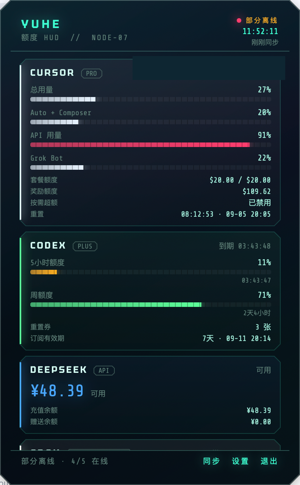
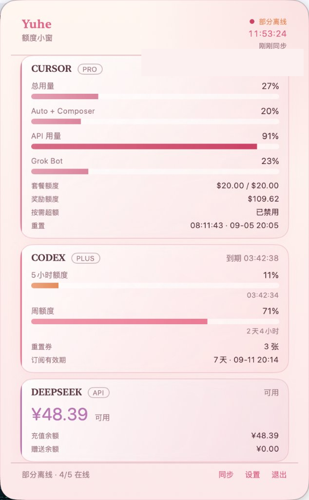
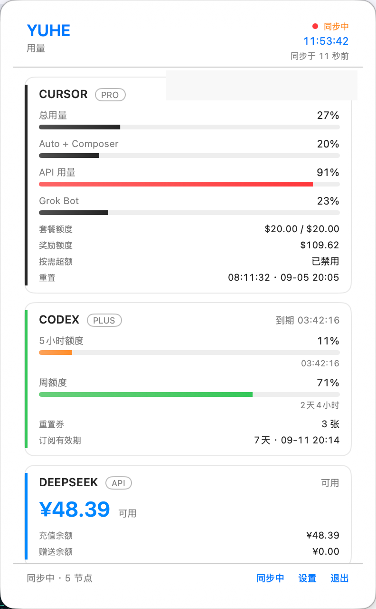
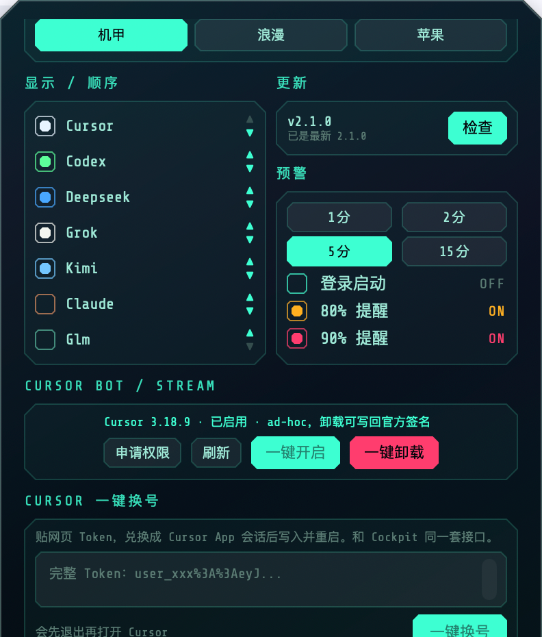
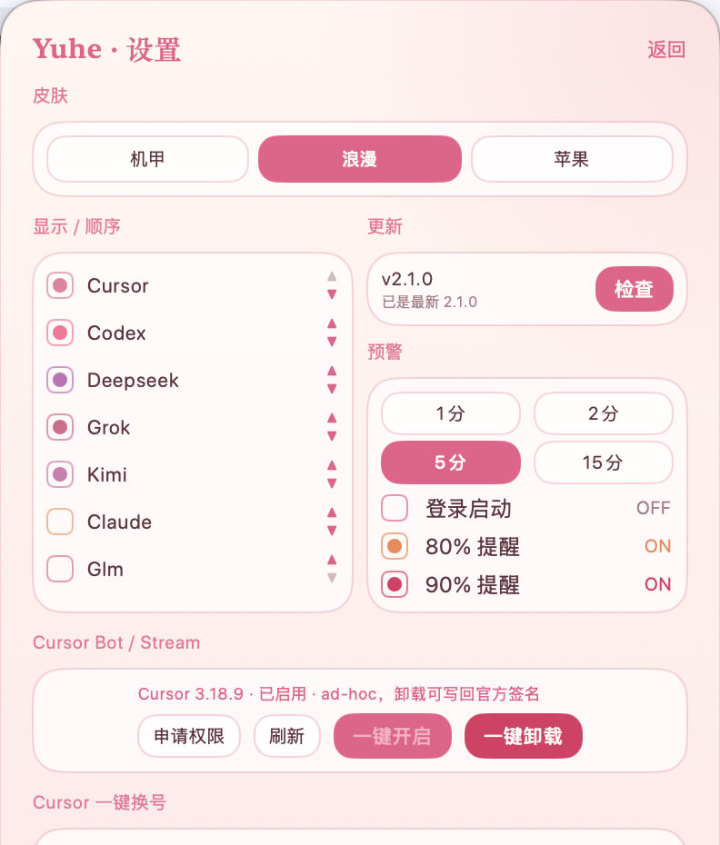
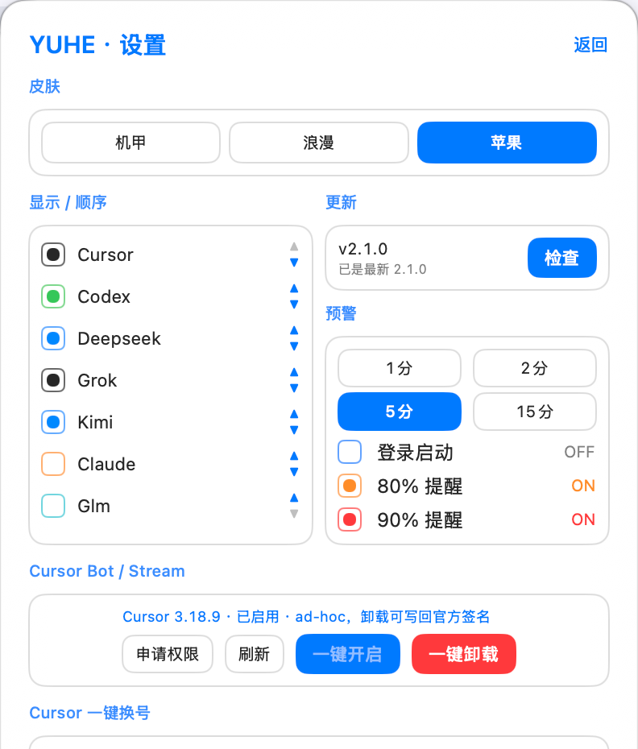

# 余核 · Quota HUD

macOS 菜单栏小工具。点一下六边形图标，就能看到 Cursor / Codex / Claude / Kimi / GLM / DeepSeek / Grok 还剩多少额度。

不占 Dock，不改你的登录态。额度从本机已登录的客户端和你自己填的 Key 来。

<p align="center">
  
</p>

[下载最新版](https://github.com/lpx0007/yuhe-quota/releases/latest) · Apple 芯片 · macOS 14+

## 三套皮肤

设置里一键切换，会记住。

| 机甲 | 浪漫 | 苹果 |
| :---: | :---: | :---: |
| 深青切角、霓虹等宽字 | 浅色奶油、圆角衬线 | 跟随系统浅色 / 深色 |
|  |  |  |

设置页同一套语言：显示顺序、自动更新、额度预警、Cursor Bot、一键换号。

<p align="center">
  
  &nbsp;
  
  &nbsp;
  
</p>

## 能干什么

- **额度看板**：用量条、重置倒计时、套餐 / 奖励余额
- **多账号源**：Cursor、Codex、Claude、Kimi、GLM、DeepSeek、Grok，显示和顺序自己排
- **预警**：80% / 90% 系统通知，刷新间隔 1 / 2 / 5 / 15 分钟
- **自动更新**：设置里检查，从 GitHub Releases 覆盖安装
- **Cursor 一键换号**：网页 Token 换成 Cursor App 会话后写入并重启
- **Cursor Bot / Stream**：给 3.18.9 一键打补丁，卸载按备份还原并写回官方签名
- **登录启动**：可选

## 额度从哪来

各用各的号，安装包不带任何人的 Key。

| 来源 | 怎么用 |
| --- | --- |
| Cursor | 本机 Cursor 已登录 |
| Codex | 本机已 `codex login` |
| Claude | 本机 Claude Code / 已有凭证 |
| Kimi | 本机已登录 Kimi |
| Grok | 本机已 `grok login` |
| DeepSeek | 设置里填自己的 API Key |
| GLM | 设置里填自己的 ZHIPU / GLM Key |

## 安装

1. 从 [Releases](https://github.com/lpx0007/yuhe-quota/releases/latest) 下载 `Yuhe-*-macos-arm64.zip`
2. 解压，把 **余核.app** 拖进「应用程序」
3. **不要双击。** 按住 Control 点图标 → 打开 → 打开  
   没有苹果开发者签名，系统会拦一次。
4. 菜单栏出现六边形后点开即可

打不开时：系统设置 → 隐私与安全性 → 仍要打开，或：

```bash
xattr -cr /Applications/余核.app
open /Applications/余核.app
```

之后在设置里点「检查 / 安装」自动更新，不必每次再发安装包。旧版本同样从本仓库 Releases 升级，仓库地址和 zip 文件名不变。

仅 **Apple 芯片**（M1 及更新）+ **macOS 14 Sonoma** 及以上。暂不支持 Intel。

本仓库是发版说明仓，不公开应用程序源码。

## Cursor Bot / Stream

给 Cursor **3.18.9** 打官方 Sand / Grok Bot 补丁。版本不对时按钮是灰的。建议关掉 Cursor 自动更新。

1. 系统设置 → 隐私与安全性 → **App 管理**，打开「余核」。没有余核时，先在设置里点「申请权限」
2. 保存 Cursor 未保存的文件（过程会退出 Cursor）
3. 余核设置 → Cursor Bot / Stream → **一键开启**
4. **一键卸载** 按安装备份还原文件，并写回官方签名

不要和「一键换号」同时点。账号需要已有官方 Sand / Grok Bot 资格，余核不会绕过服务端校验。

## 许可

个人使用。改 Cursor.app 属于你自己的风险，出问题先点「一键卸载」。
